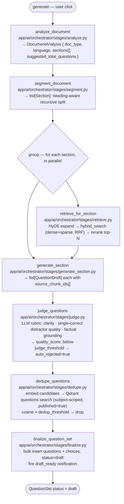

# AI pipeline

The orchestrator turns an `Upload` into a `QuestionSet` through a sequence of small, observable stages. Every stage publishes SSE events; every provider call is logged to `ai_runs`.

## Stages

The canvas is built by `app/ai/orchestrator/graph.py::build_generation_workflow`. The fan-out across sections is a Celery `chord(group(...), callback=judge_questions.s())`.

## SSE events

Channel: `ai:events:{upload_id}`. Browsers subscribe via `GET /api/v1/uploads/{id}/events`.

| Event | Fired by | Payload (high level) |
|---|---|---|
| `extract.started` / `extract.completed` | `process_upload` | `backend`, `strategy`, char count |
| `embed.started` / `embed.completed` | `embed_chunks` | chunk count, `cache_hit` |
| `analyze.completed` | analyze | `sections`, `language`, `doc_type` |
| `generate.section.started` / `generate.section.completed` | generate_section | section index, candidate count |
| `retrieve.completed` / `retrieve.degraded` | retrieve | top-N chunk IDs; `degraded=true` when Qdrant/embedder failed open |
| `judge.completed` | judge | average score, rejected count |
| `dedupe.completed` | dedupe | `kept`, `dropped` |
| `generate.completed` | finalize | terminal — closes the SSE stream |
| `error` | any | task name, message |

## Telemetry — `ai_runs`

Every LLM, embedding, and rerank call is wrapped in `app/ai/telemetry.py::run_logged(...)` and inserts a row with:

- `parent_run_id` — links retries / sub-tasks back to the originating run
- `task` — orchestrator stage name (`analyze`, `generate_section`, `judge`, `dedupe`, `contextualize`, …)
- `provider`, `model`, `credential_alias`, `prompt_version_id`
- `input_tokens`, `output_tokens`, `cost_usd` (computed from `ai_models` pricing)
- `latency_ms`, `cache_hit`, `status`

The admin AIRunsPage and dashboard read from this table directly. See [admin.md](admin.md#runs--dashboard).

## Profiles and overrides

A `ResolvedProfile` controls which model and credential each stage uses, plus thresholds. Resolution order (from `app/ai/orchestrator/profile.py::load_profile`):

1. `profile_id` explicitly supplied by an admin on the generate request.
2. A `generation_profiles` row matching the upload's subject.
3. The global default profile row (`is_default=true`).
4. **Registry-driven default** — top active model per `kind` from `ai_models`, ordered by `sort_order`. Deactivating a model in the admin Models page actually changes what runs.
5. Hardcoded fallback (only if the registry is empty — should not happen in practice).

Per-run overrides come through `GenerateRequest.extraction_model_id` and `GenerateRequest.profile_id`. The service validates that the user is admin and that the referenced rows are active before invoking the orchestrator. `graph.py::_apply_overrides` resolves the `ai_models` UUID and patches **provider + model + credential together** so an OpenAI model under an Anthropic profile doesn't silently call the wrong API.

## Result cache + rate limiter

- **Cache** (`app/ai/cache.py`): keyed on `sha256(chunk + prompt_version + model + retrieved_context_hash)`, 24h TTL in Redis. `cache_hit=true` on the `ai_runs` row when used.
- **Rate limiter** (`app/ai/limits.py`): Redis token bucket keyed on `(provider, credential_alias)`. Back-pressure via `apply_async(countdown=...)`.

## Budget guards

`app/ai/budget.py` enforces:

- Per-user daily token cap (`USER_DAILY_TOKEN_BUDGET`)
- Per-QuestionSet hard cap (`QS_MAX_TOKENS`)
- Per-credential monthly cap (`ai_credentials.monthly_budget_usd`)

Generate requests that would exceed any of these return 429 with a clear reason.

## Replay

`POST /api/v1/question-sets/{id}/replay` clones a question set (links via `parent_question_set_id`) and re-runs the canvas with optional overrides for prompt version, model, profile, or credential alias. The replay reuses cached embeddings when nothing about the embedding model has changed — verifiable via `embed.cache_hit=true` on the SSE stream.

The Review page shows a side-by-side diff between a replayed set and its parent.
