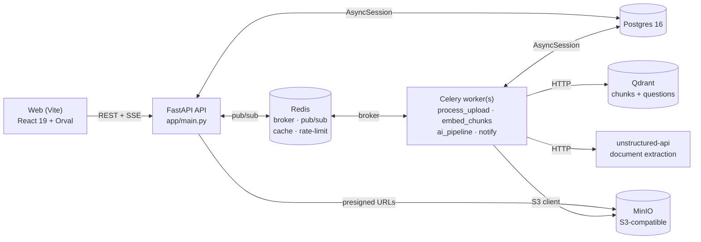
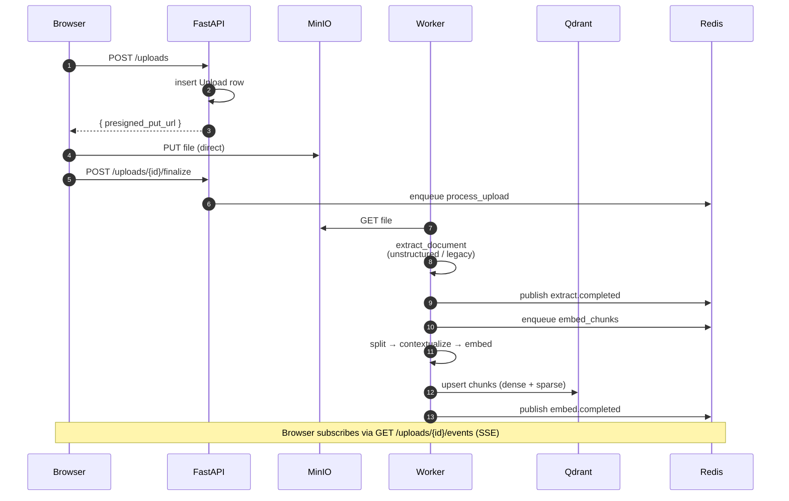
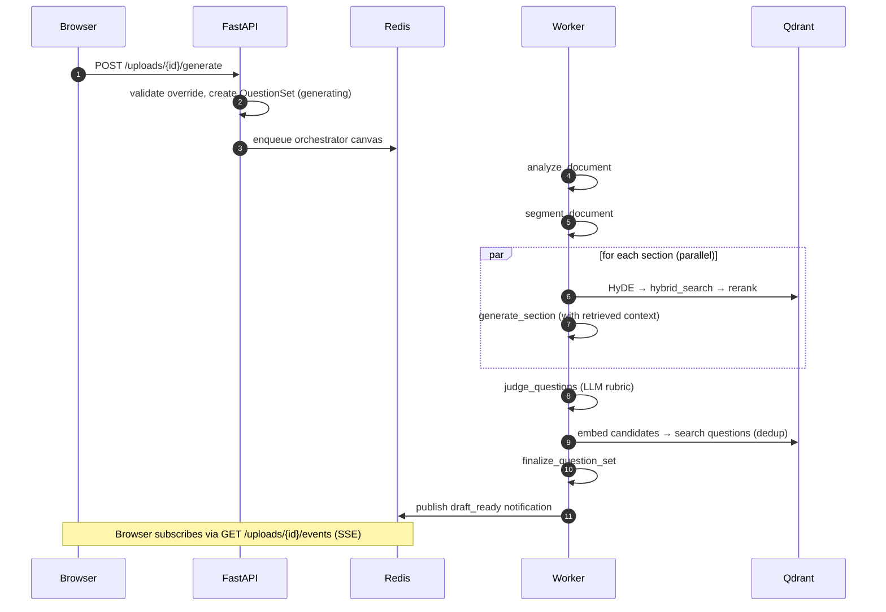
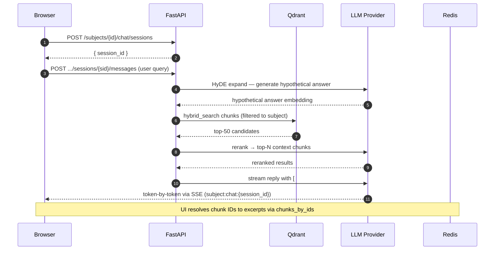

# Architecture

A bird's-eye view of services, data flow, and where each kind of state lives.

## Services

All services are defined in `docker-compose.yml`. Healthchecks gate boot order for Postgres, Redis, and MinIO; Qdrant and unstructured-api start without one (the clients retry on first call).

## Request paths

### Upload → ready

1. `POST /uploads` creates the row and returns a **presigned PUT** for MinIO.
2. Browser uploads the file **directly** to MinIO (no proxy through the API).
3. `POST /uploads/{id}/finalize` enqueues `process_upload`.
4. `process_upload` (queue `uploads`): pulls from S3, calls the extraction dispatcher (`unstructured` by default, `legacy` as fallback), persists `extracted_text` + `extraction_backend` + `extraction_strategy`, chains into `embed_chunks`.
5. `embed_chunks` (queue `embeddings`): heading-aware split → contextual summary per chunk → dense (OpenAI) + sparse (BM25) embed → upsert into Qdrant `chunks` and companion rows into `document_chunks`.
6. Upload status flips to `ready`. Every stage publishes events on `ai:events:{upload_id}`; the browser consumes them via SSE.

### Generate → draft

1. Browser calls `POST /api/v1/uploads/{id}/generate` with `count`, `difficulty_mix`, optional `extraction_model_id` / `profile_id` (admin only).
2. Service validates the override, creates a `QuestionSet` (status `generating`), enqueues the orchestrator canvas.
3. Orchestrator runs **analyze → segment → (group: retrieve → generate per section) → judge → dedupe → finalize**. See [ai-pipeline.md](ai-pipeline.md).
4. `finalize` flips `QuestionSet.status` to `draft`, fires the `draft_ready` notification.

### Subject Q&A chat

1. Browser opens an SSE session keyed by `{session_id}` on the subject's chat tab.
2. Backend's `qa.py` runs HyDE → hybrid search Qdrant `chunks` filtered to the subject → rerank → streams the assistant reply with `[#chunk_id]` citation markers.
3. UI resolves chunk IDs to verbatim excerpts via `chunks_by_ids`.

## Where state lives

| State | Where | Notes |
|---|---|---|
| Users, subjects, uploads, question sets, choices, attempts | Postgres | Authoritative. Migrations in `backend/app/db/migrations/versions/`. |
| Uploaded file bytes | MinIO (`studentsclub-uploads`) | Object key stored on `Upload`. |
| Chunk text + metadata | Postgres `document_chunks` | Source of truth for chunk content. |
| Chunk vectors (dense + sparse) | Qdrant `chunks` collection | Subject-scoped via payload filter. |
| Question dedup vectors | Qdrant `questions` collection | Upserted at publish, deleted on reject. |
| AI run telemetry | Postgres `ai_runs` | One row per provider call; powers admin dashboard. |
| Prompts | Postgres `ai_prompts` | Versioned, hot-swap by activating a new version. |
| Credentials | Postgres `ai_credentials` | Fernet-encrypted at rest; plaintext never leaves the backend. |
| Model registry | Postgres `ai_models` | Top active model per `kind` (ordered by `sort_order`) is the registry default. |
| Generation profiles | Postgres `generation_profiles` | Per-subject overrides; falls back to a global default. |
| Extraction settings | Postgres `extraction_settings` | Single global row, admin-editable. |
| Rate-limit buckets | Redis | Per `(provider, credential_alias)`. |
| Result cache | Redis | SHA256 keyed, 24h TTL. |
| SSE events | Redis pub/sub channels | `ai:events:{upload_id}` and `subject:chat:{session_id}`. |

## Queues

Celery (`backend/app/workers/celery_app.py`) routes by task name into four queues:

| Queue | Tasks | Why isolated |
|---|---|---|
| `uploads` | `process_upload` | Fast I/O work; should not be blocked by long AI calls. |
| `embeddings` | `embed_chunks`, contextualize sub-tasks | Embedding APIs have separate quotas. |
| `ai` | Orchestrator stages, judge, dedupe | The "expensive" queue. |
| `celery` | Default, notifications | Misc. |
| `dead_letter` | — | Failure handler re-routes payloads here with metadata. |

Workers are launched with `--queues uploads,ai,embeddings,celery` by default. `task_time_limit=900`, `task_soft_time_limit=840`, `task_acks_late=True`, `task_reject_on_worker_lost=True`.

## Auth

JWT access + refresh tokens. Refresh tokens are rotated on every use. Admin endpoints (`/api/v1/admin/*`) require `is_admin=true`. SSE endpoints accept the JWT as a `?token=` query parameter because browsers can't set headers on `EventSource`.

## Why these choices

- **Async-first** end to end (FastAPI + asyncpg + Celery + httpx) so the orchestrator can do parallel per-section LLM calls without thread juggling.
- **Qdrant** over pgvector for native hybrid search, payload filters at scale, and built-in quantization. See [rag.md](rag.md).
- **Postgres as source of truth, Qdrant as index.** Chunks are persisted twice (text in Postgres, vectors in Qdrant) so we can re-embed without re-extracting.
- **Telemetry on every call.** `ai_runs` is the single observability surface for cost, latency, and quality — the admin dashboard reads it directly.
