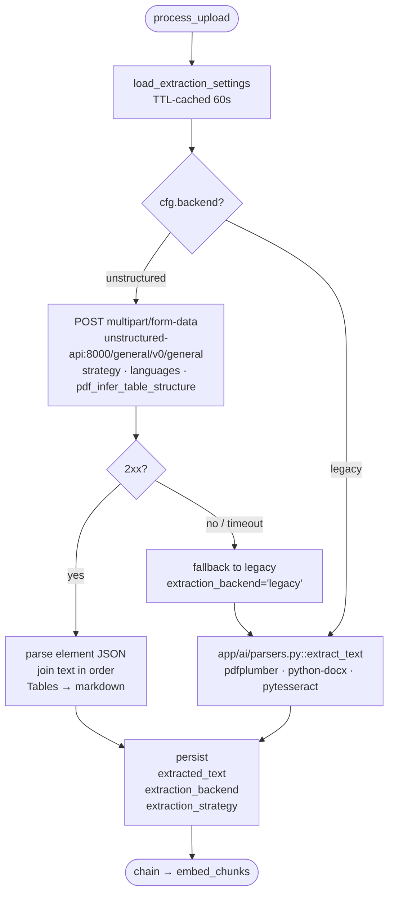

# Document extraction

The pipeline supports two extraction backends:

- **`unstructured`** (default) — runs the [`unstructured-api`](https://github.com/Unstructured-IO/unstructured-api) Docker service. Layout-aware, OCR-capable, applies the Unicode bidi algorithm correctly. Handles Arabic / Hebrew / RTL text properly. Handles scanned PDFs via tesseract with configurable languages.
- **`legacy`** — `pdfplumber` for PDFs, `python-docx` for DOCX, `pytesseract` for images. Kept as a fallback for resilience and for hosts that can't run the unstructured service. **Does not** apply the bidi algorithm — Arabic comes out reversed.

The choice is a single global row in the `extraction_settings` table, edited from the admin Extraction page.

## How a document is processed



1. `process_upload` loads the row via `app/ai/extraction/config.py::load_extraction_settings(db)` (TTL-cached, 60s).
2. It calls `app/ai/extraction/__init__.py::extract_document(content, content_type, filename, cfg)` — the single entry point.
3. If `cfg.backend == "unstructured"`:
   - POST `multipart/form-data` to `{UNSTRUCTURED_API_URL}/general/v0/general` with form fields `strategy`, `languages` (one per OCR language), `pdf_infer_table_structure`, `hi_res_model_name`.
   - Parse the returned element JSON; join element `text` in order. Tables render as their `metadata.text_as_html` → markdown when `extract_tables=true`.
   - On connection error or non-2xx → **falls back to legacy** and records `extraction_backend='legacy'` on the upload.
4. If `cfg.backend == "legacy"` → calls `app/ai/parsers.py::extract_text` directly.
5. Persists `Upload.extracted_text`, `Upload.extraction_backend`, `Upload.extraction_strategy`.

The Preview UI surfaces "Extracted with: unstructured · hi_res · eng+ara" so reviewers know what produced the text.

## Strategies

| Strategy | When to use |
|---|---|
| `auto` (default) | Lets unstructured pick per page. Good general-purpose choice. |
| `hi_res` | Forces a layout model (`yolox` by default). Best for slides, multi-column papers, complex layouts. Slower, heavier. |
| `ocr_only` | Forces tesseract on every page. Use for scanned PDFs where `auto` mis-detects them as digital. |
| `fast` | Text-extraction only, skips layout/OCR. Cheapest; use only for known-clean digital PDFs. |

## OCR languages

The `ocr_languages` column is `text[]` — pass tesseract three-letter codes. The default is `{eng, ara}` to handle the bilingual material in the seed dataset.

Common codes: `eng`, `ara`, `fra`, `deu`, `spa`, `chi_sim`, `chi_tra`, `jpn`. The unstructured-api image bundles tesseract with all standard language packs.

## Arabic / RTL handling

The reason `unstructured` is the default: `pdfplumber.extract_text()` pulls glyphs by x-position and does **not** apply the Unicode bidi algorithm. Arabic text comes out reversed at both the word and intra-word glyph levels. The unstructured backend routes image-bearing and scanned pages through tesseract with `ocr_languages` including `ara`, which handles bidi correctly.

If you must keep `legacy` enabled for some reason (e.g. you can't run the docker service), known-bilingual material will render Arabic backwards. Switching backends does not re-process existing uploads automatically; re-upload or run a manual re-process.

## Admin settings

`GET /api/v1/admin/extraction` returns the current row. `PUT /api/v1/admin/extraction` updates it (admin-only).

| Field | Type | Notes |
|---|---|---|
| `backend` | `unstructured` \| `legacy` | Toggle. |
| `strategy` | `auto` \| `hi_res` \| `ocr_only` \| `fast` | See above. |
| `ocr_languages` | `text[]` | Tesseract 3-letter codes. Default `{eng, ara}`. |
| `extract_tables` | bool | Render HTML tables as markdown in the extracted text. |
| `hi_res_model_name` | `text` (nullable) | Override the layout model when `strategy=hi_res`. Leave null for default. |
| `max_characters` | `int` (nullable) | Soft cap on extracted text length. |

The page is at `/admin/extraction` in the web app.

## Healthcheck

```bash
curl http://localhost:8001/healthcheck
```

The unstructured service runs on port 8001 host-side (container port 8000). The api/worker containers reach it via the docker network at `http://unstructured-api:8000`.

## Per-upload metadata

Two columns on `uploads`:

- `extraction_backend text?` — what actually produced the text (`unstructured` or `legacy`, after fallback).
- `extraction_strategy text?` — the strategy used at extraction time.

These are surfaced in `UploadResponse` / `UploadDetailResponse` so the UI can render the badge without an extra round-trip.
