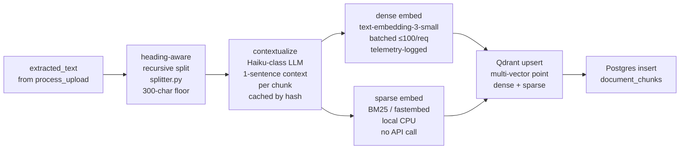
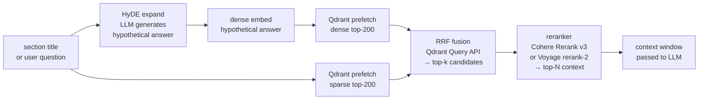

# RAG on Qdrant

The retrieval layer is built around two Qdrant collections, both subject-scoped via payload filter. Vectors live in Qdrant; chunk text and question content stay in Postgres.

## Why Qdrant

- **Native hybrid search** — dense + sparse on a single point, server-side fused with RRF.
- **Payload filters at scale** — subject / language / doc-type filters are indexed and combine cleanly with HNSW.
- **Built-in quantization** — scalar (4×) and binary (32×) per collection.
- **Operational features** — snapshots, replication, distributed mode if scale demands.

The trade-off: vectors are out-of-band from Postgres. We keep the two stores in sync by using the same UUID for `document_chunks.id` and the Qdrant point ID — there's no separate sync table.

## Collections

### `chunks`

Multi-vector points, one per document chunk.

- **Dense vector** — `text-embedding-3-small` (1536d, cosine). Scalar-quantized to `int8` with `always_ram=true`.
- **Sparse vector** — BM25 via `fastembed.SparseTextEmbedding("Qdrant/bm25")`. Local, no API call.
- **Payload**: `chunk_id`, `upload_id`, `subject_id`, `position`, `section_title`, `text` (truncated to ~2 KB for hit previews), `language`, `doc_type`, `embedding_model`, `embedding_version`.
- **Indexes**: `subject_id`, `upload_id`, `language` (keyword index).

### `questions`

Single-vector points, used only for dedup.

- **Dense vector** — same model as `chunks` so similarity is meaningful across both. Scalar-quantized.
- **Payload**: `question_id`, `subject_id`, `published` bool, `embedding_model`, `embedding_version`.
- **Indexes**: `subject_id`, `published`.

Questions are upserted at publish time and removed on reject / deactivate.

## Indexing pipeline

`embed_chunks` chains off `process_upload` and runs:



1. **Heading-aware recursive split** (`app/ai/rag/splitter.py`) — Markdown headers → paragraphs → sentences. 300-char floor.
2. **Contextual retrieval** (`app/ai/rag/contextualize.py`) — for each chunk, a cheap LLM call (Haiku-class by default) produces a 1-sentence context derived from the doc title + section. Prepended to the chunk text before embedding. Cached per `hash(chunk + doc + section)`.
3. **Dense embed** — `text-embedding-3-small`, batched ≤100/request, retry-with-backoff, telemetry-logged.
4. **Sparse embed** — BM25 locally on CPU.
5. **Upsert** — single `points.upsert` per batch into Qdrant; companion row into `document_chunks`.

`embedding_version` is stored alongside `embedding_model`. When either changes, `backend/scripts/reembed.py` walks affected rows and re-runs the pipeline; the toggle is atomic per chunk so reads stay consistent.

## Search

`app/ai/rag/index.py::hybrid_search(subject_id, query_text, k=50, alpha=0.5, filters?)`:



- Server-side **prefetch**: dense top-200 + sparse top-200.
- **RRF fusion** — Qdrant's built-in Query API combines the two prefetches.
- Returns top-k with payload + score.

The generation orchestrator calls this for each section after **HyDE query expansion** — a cheap LLM generates a hypothetical answer to the section topic; the embedding of *that* drives retrieval. Better recall on short, terse section titles than embedding the raw title.

After hybrid search, the top-k is **reranked** to the top-N (`profile.top_n_rerank`, default 8) via Cohere Rerank v3 or Voyage rerank-2. The reranker is pluggable — see `app/ai/rag/reranker/`.

## Dedup

`app/ai/rag/index.py::search_questions(subject_id, embedding, threshold)`:

- Embed the candidate question.
- Search the `questions` collection filtered to the same subject and `published=true`.
- Drop the candidate if cosine > `profile.dedup_threshold` (default 0.92).

Dropped candidates are not silently deleted — they're surfaced in the SSE `dedupe.completed` event so the reviewer knows the bank is converging.

## Citations

The generation prompt requires each question to emit `source_chunk_ids` referencing chunks from the supplied context window. The judge stage validates that the cited chunks exist and that the correct answer is grounded in at least one of them. Questions with empty `source_chunk_ids` are flagged in the Review UI with a red "citation health" badge.

`Question.source_chunk_ids` is `uuid[]` referencing `document_chunks.id`. The Sources panel in the Review UI calls `GET /chunks?ids=…` (admin / owner gated) to render verbatim excerpts.

## Failure modes

- **Qdrant down or unreachable**: `retrieve` sets `context.degraded=True`, emits `retrieve.degraded` on SSE, and the judge knocks the score for degraded sections. Generation does **not** silently proceed with empty context.
- **Embedder down**: same treatment — sections that couldn't retrieve are marked degraded.
- **Reranker down**: falls back to the unreranked hybrid top-N (slightly worse recall on subtle queries; logged but non-fatal).

## Local inspection

- Qdrant dashboard: <http://localhost:6333/dashboard>
- Collection size:

  ```bash
  curl -s http://localhost:6333/collections/chunks | jq '.result.points_count'
  ```

- Count chunks for an upload:

  ```bash
  curl -s -X POST http://localhost:6333/collections/chunks/points/count \
    -H 'Content-Type: application/json' \
    -d '{"filter":{"must":[{"key":"upload_id","match":{"value":"<UUID>"}}]}}'
  ```
